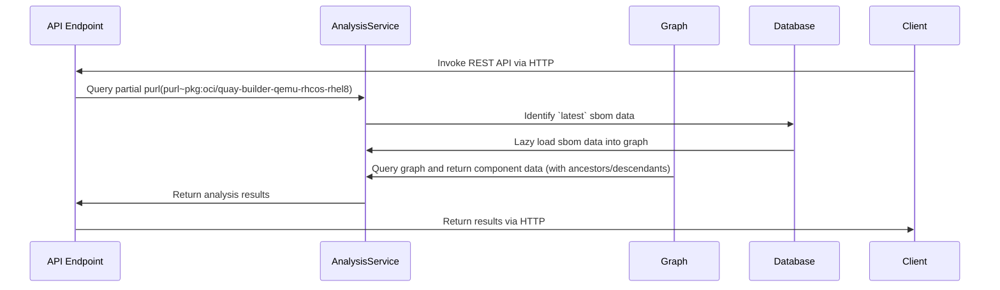
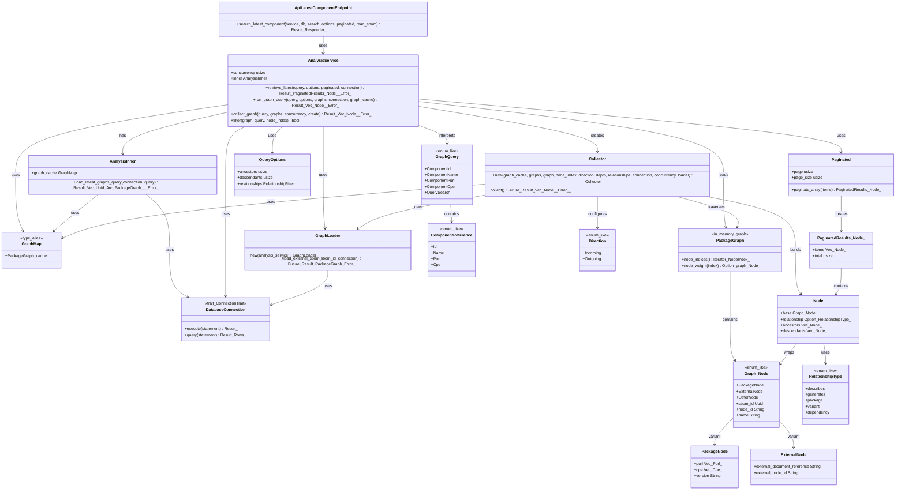
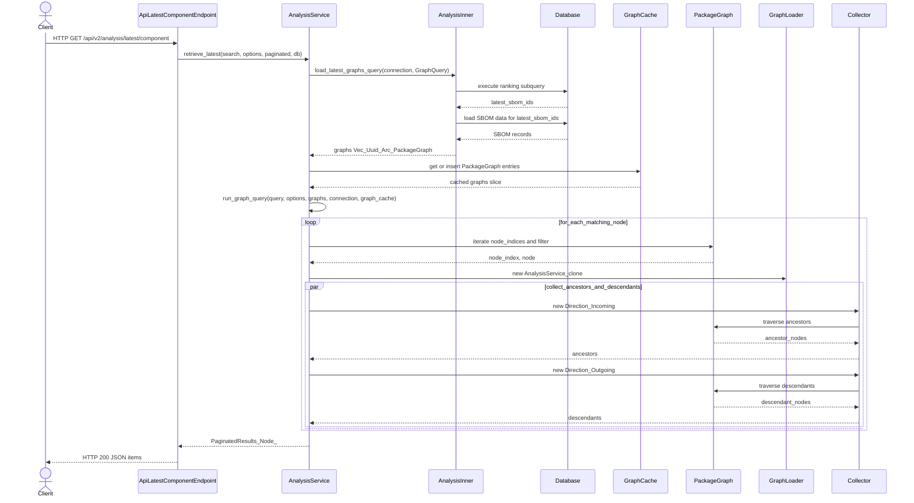

# 00011. 'latest' implementation

Date: 2025-11-27

## Status

Draft

## Context

This is retroactive and comprehensive ADR describing current process for querying Trustify in memory graph for 'latest' 
components to aid any poor souls who wander into this part of the codebase.

Consider the following curl invoke on Trustify REST API (with `export AUTH_DISABLED=true`):
):
```
curl "http://localhost:8080/api/v2/analysis/latest/component?q=purl~pkg%3Aoci%2Fquay-builder-qemu-rhcos-rhel8"
```
Instructs analysis service to perform a partial purl match query which roughly processes as follows:


At first glance - this diagram does not reveal the complexity of the dance between the database (which contains all sbom data) and
and in memory graph collection. 

Relational databases representing hierarchical relationships blow up under 'join explosion' making dynamic, direct 
queries, against the database, for these relationships unrealistic. A more natural internal representation, an in-memory graph, means such queries are simplified (eg. find root, link external sboms, return ancestors/descendants) 
and perform much better.

We decided some time ago (and the subject of previous ADRS [graph analytics](00001-graph-analytics.md),[analysis](00002-analysis-graph.md), [external sboms](00003-external-references.md)) 
that a fully fledged graph data store with persistence was not a dependency we need to adopt
in the project (at this time) - as the 'window' of interest is mostly about performing graph queries on a subset of sboms that are the
current _latest_ products. 

That is we want to perform queries on the latest version of a product (which are often represented across a set of 
sboms) - this much smaller subset than 'all the sboms' related to a product over time contributes to making
graph queries faster to resolve.

The problem the analysis module tries to solve is to ensure we load the most relevant sboms into the in-memory
graph to be able to perform graph queries on them. 

Most of the complexity is contained by the process that loads sboms into the in memory graph and the actual 
query of the graph.

The critical code path starts off with an invoke of `search_latest_component`(`modules/analysis/src/service/mod.rs#186`):

```rust
pub async fn search_latest_component(
    service: web::Data<AnalysisService>,
    db: web::Data<Database>,
    web::Query(search): web::Query<Query>,
    web::Query(options): web::Query<QueryOptions>,
    web::Query(paginated): web::Query<Paginated>,
    _: Require<ReadSbom>,
) -> actix_web::Result<impl Responder> {
    Ok(HttpResponse::Ok().json(
        service
            .retrieve_latest(&search, options, paginated, db.as_ref())
            .await?,
    ))
}
```

Which in turn invokes `retrive_latest` (`modules/analysis/src/service/mod.rs#599`):

```rust
    pub async fn retrieve_latest<C: ConnectionTrait>(
        &self,
        query: impl Into<GraphQuery<'_>> + Debug,
        options: impl Into<QueryOptions> + Debug,
        paginated: Paginated,
        connection: &C,
    ) -> Result<PaginatedResults<Node>, Error> {
        let query = query.into();
        let options = options.into();

        // load only latest graphs
        let graphs = self
            .inner
            .load_latest_graphs_query(connection, query)
            .await?;

        log::debug!("graph sbom count: {:?}", graphs.len());

        let components = self
            .run_graph_query(
                query,
                options,
                &graphs,
                connection,
                self.inner.graph_cache.clone(),
            )
            .await?;

        Ok(paginated.paginate_array(&components))
    }
```

The `graphs` variable will contain a 'slice' of the in memory graph forest as a `Vec<(Uuid, Arc<PackageGraph>)>` which is the source for any
in memory graph queries. This is the set of latest sboms in graph form which is used by `components` to performs the 
in-memory graph query itself.

#### Identify `latest` sbom

There are a few critical challenges identifying a set of sboms from the relational database.

When we invoke the chunky `load_latest_graphs_query` (`modules/analysis/src/service/load.rs#340`) where
the op
```rust
        let latest_sbom_ids = match query {
            GraphQuery::Component(ComponentReference::Id(node_id)) => {
                let subquery = find::<sbom_node::Entity>()
                    .join(JoinType::LeftJoin, sbom_node::Relation::Package.def())
                    .join_cpe()
                    .filter(sbom_node::Column::NodeId.eq(node_id));

                query_all(subquery.into_query(), connection).await?
            }
            GraphQuery::Component(ComponentReference::Name(name)) => {
                let subquery = find_rank_name::<sbom_node::Entity>()
                    .join(JoinType::LeftJoin, sbom_node::Relation::Package.def())
                    .join_cpe()
                    .filter(sbom_node::Column::Name.eq(name));

                query_all(subquery.into_query(), connection).await?
            }
            GraphQuery::Component(ComponentReference::Purl(purl)) => {
                let subquery = find_rank_name::<sbom_package_purl_ref::Entity>()
                    .join(JoinType::LeftJoin, sbom_package::Relation::Purl.def().rev())
                    .join(JoinType::LeftJoin, sbom_node::Relation::Package.def().rev())
                    .join_cpe()
                    .filter(
                        sbom_package_purl_ref::Column::QualifiedPurlId.eq(purl.qualifier_uuid()),
                    );

                query_all(subquery.into_query(), connection).await?
            }
            GraphQuery::Component(ComponentReference::Cpe(cpe)) => {
                let subquery = find::<sbom_node::Entity>()
                    .join(
                        JoinType::LeftJoin,
                        sbom_node::Relation::PackageBySbomId.def(),
                    )
                    .join_cpe()
                    // For CPE searches the .not_like("pkg:%") filter is required
                    .filter(sbom_node::Column::Name.not_like("pkg:%"))
                    .filter(sbom_package_cpe_ref::Column::CpeId.eq(cpe.uuid()));

                query_all(subquery.into_query(), connection).await?
            }
            GraphQuery::Query(query) => {
                let subquery = find_rank_name::<sbom_node::Entity>()
                    .join(JoinType::LeftJoin, sbom_node::Relation::Package.def())
                    .join(JoinType::LeftJoin, sbom_package::Relation::Purl.def())
                    .join(
                        JoinType::LeftJoin,
                        sbom_package_purl_ref::Relation::Purl.def(),
                    )
                    .join_cpe()
                    .filtering_with(query.clone(), q_columns())?;

                query_all(subquery.into_query(), connection).await?
            }
        };
```
We are trying to identify the latest sbom ids. 

Depending on the query type (cpe, component name or purl) we generate a specific subquery which
does the 'heavy lifting' and ranking by latest 

```rust
        fn build_ranked_query<E>(partition_by_name: bool) -> Select<E>
        where
            E: EntityTrait + Related<sbom::Entity>,
        {
            // Dynamically select the RANK SQL based on the flag
            let rank_sql = if partition_by_name {
                // for CPE queries
                "RANK() OVER (PARTITION BY sbom_node.name, cpe.id ORDER BY sbom.published DESC)"
            } else {
                // for exact/partial name queries
                "RANK() OVER (PARTITION BY cpe.id ORDER BY sbom.published DESC)"
            };

            E::find()
                .select_only()
                .column(sbom::Column::SbomId)
                .column(sbom::Column::Published)
                .column(cpe::Column::Id)
                .column_as(Expr::cust(rank_sql), "rank") // Use the selected SQL string
                .left_join(sbom::Entity)
        }
```
The `RANK() OVER` idiom is a classic SQL way partition (eg. group) query results.

In sql the ranking subquery (which is matching on partial purl) looks like:

```sql
     SELECT
         "sbom"."sbom_id",
         "sbom"."published",
         "cpe"."id",
         RANK() OVER (
             PARTITION BY cpe.id
             ORDER BY
                 sbom.published DESC
         ) AS "rank"
     FROM
         "sbom_node"
     LEFT JOIN "sbom_package" ON 
         "sbom_node"."sbom_id" = "sbom_package"."sbom_id"
         AND "sbom_node"."node_id" = "sbom_package"."node_id"
     LEFT JOIN "sbom" ON 
         "sbom_node"."sbom_id" = "sbom"."sbom_id"
     LEFT JOIN "sbom_package_purl_ref" ON 
         "sbom_package"."sbom_id" = "sbom_package_purl_ref"."sbom_id"
         AND "sbom_package"."node_id" = "sbom_package_purl_ref"."node_id"
     LEFT JOIN "qualified_purl" ON 
         "sbom_package_purl_ref"."qualified_purl_id" = "qualified_purl"."id"
     LEFT JOIN "sbom_package_cpe_ref" ON 
         "sbom_package"."sbom_id" = "sbom_package_cpe_ref"."sbom_id"
     LEFT JOIN "cpe" ON 
         "sbom_package_cpe_ref"."cpe_id" = "cpe"."id"
     WHERE
         ("qualified_purl"."purl" ->> 'ty') = 'oci'
       AND ("qualified_purl"."purl" ->> 'name') = 'quay-builder-qemu-rhcos-rhel8'
```

this query returns sbom ids and ranks them based on cpe.id and/or component name ... in the example query we group by 
cpe-id then set RANK=1 based on order of `sbom.published`. 

Example output of which is:
```markdown
+--------------------------------------+------------------------+--------------------------------------+------+
| sbom_id                              | published              | id                                   | rank |
|--------------------------------------+------------------------+--------------------------------------+------|
| 019ac9d8-b0d4-7713-be98-649f8e819574 | 2025-04-02 22:06:32+02 | ee7a50e3-7e58-5c2c-997d-5ad9a83cdc5e | 1    |
| 019ac9d8-b0d4-7713-be98-649f8e819574 | 2025-04-02 22:06:32+02 | ee7a50e3-7e58-5c2c-997d-5ad9a83cdc5e | 1    |
| 019ac9d8-b0d4-7713-be98-649f8e819574 | 2025-04-02 22:06:32+02 | ee7a50e3-7e58-5c2c-997d-5ad9a83cdc5e | 1    |
| 019ac9d8-b0d4-7713-be98-649f8e819574 | 2025-04-02 22:06:32+02 | ee7a50e3-7e58-5c2c-997d-5ad9a83cdc5e | 1    |
| 019ac9d8-9639-7102-8133-1026799b80e3 | 2025-02-24 04:44:11+01 | ee7a50e3-7e58-5c2c-997d-5ad9a83cdc5e | 5    |
| 019ac9d8-9639-7102-8133-1026799b80e3 | 2025-02-24 04:44:11+01 | ee7a50e3-7e58-5c2c-997d-5ad9a83cdc5e | 5    |
| 019ac9d8-9639-7102-8133-1026799b80e3 | 2025-02-24 04:44:11+01 | ee7a50e3-7e58-5c2c-997d-5ad9a83cdc5e | 5    |
| 019ac9d8-9639-7102-8133-1026799b80e3 | 2025-02-24 04:44:11+01 | ee7a50e3-7e58-5c2c-997d-5ad9a83cdc5e | 5    |
| 019ac9d8-b0d4-7713-be98-648e5e345209 | 2025-04-04 03:40:23+02 | <null>                               | 1    |
| 019ac9d8-b0d4-7713-be98-648e5e345209 | 2025-04-04 03:40:23+02 | <null>                               | 1    |
| 019ac9d8-b0d4-7713-be98-648e5e345209 | 2025-04-04 03:40:23+02 | <null>                               | 1    |
| 019ac9d8-b0d4-7713-be98-648e5e345209 | 2025-04-04 03:40:23+02 | <null>                               | 1    |
| 019ac9d8-b0d4-7713-be98-648e5e345209 | 2025-04-04 03:40:23+02 | <null>                               | 1    |
| 019ac9d8-b0d4-7713-be98-648e5e345209 | 2025-04-04 03:40:23+02 | <null>                               | 1    |
| 019ac9d8-b0d4-7713-be98-648e5e345209 | 2025-04-04 03:40:23+02 | <null>                               | 1    |
| 019ac9d8-b12d-7922-a0d2-6322421b8993 | 2025-04-04 03:36:12+02 | <null>                               | 8    |
| 019ac9d8-b12d-7922-a0d2-6322421b8993 | 2025-04-04 03:36:12+02 | <null>                               | 8    |
| 019ac9d8-b12d-7922-a0d2-6322421b8993 | 2025-04-04 03:36:12+02 | <null>                               | 8    |
| 019ac9d8-b12d-7922-a0d2-6322421b8993 | 2025-04-04 03:36:12+02 | <null>                               | 8    |
| 019ac9d8-9639-7102-8133-10334bc0bfa9 | 2025-02-24 04:50:33+01 | <null>                               | 12   |
| 019ac9d8-9639-7102-8133-10334bc0bfa9 | 2025-02-24 04:50:33+01 | <null>                               | 12   |
| 019ac9d8-9639-7102-8133-10334bc0bfa9 | 2025-02-24 04:50:33+01 | <null>                               | 12   |
| 019ac9d8-9639-7102-8133-10334bc0bfa9 | 2025-02-24 04:50:33+01 | <null>                               | 12   |
| 019ac9d8-9639-7102-8133-10334bc0bfa9 | 2025-02-24 04:50:33+01 | <null>                               | 12   |
| 019ac9d8-9639-7102-8133-10334bc0bfa9 | 2025-02-24 04:50:33+01 | <null>                               | 12   |
| 019ac9d8-9639-7102-8133-10334bc0bfa9 | 2025-02-24 04:50:33+01 | <null>                               | 12   |

```

Then we invoke `query_all` which executes the query itself:

```rust
        async fn query_all<C>(subquery: SelectStatement, connection: &C) -> Result<Vec<Uuid>, Error>
        where
            C: ConnectionTrait,
        {
            let select_query = Query::select()
                .expr(Expr::col(Alias::new("sbom_id")))
                .from_subquery(subquery, Alias::new("subquery"))
                .cond_where(Expr::col(Alias::new("rank")).eq(1))
                .distinct()
                .to_owned();
            let (sql, values) = select_query.build(PostgresQueryBuilder);

            let rows: Vec<Row> = Row::find_by_statement(Statement::from_sql_and_values(
                DatabaseBackend::Postgres,
                sql,
                values,
            ))
            .all(connection)
            .await?;

            Ok(rows.into_iter().map(|row| row.sbom_id).collect())
        }
```
which takes the previous subquery ... the entire SQL query now looks like:

```sql
SELECT DISTINCT
     "sbom_id"
 FROM
     (
         SELECT
             "sbom"."sbom_id",
             "sbom"."published",
             "cpe"."id",
             RANK() OVER (
                 PARTITION BY cpe.id
                 ORDER BY
                     sbom.published DESC
             ) AS "rank"
         FROM
             "sbom_node"
         LEFT JOIN "sbom_package" ON 
             "sbom_node"."sbom_id" = "sbom_package"."sbom_id"
             AND "sbom_node"."node_id" = "sbom_package"."node_id"
         LEFT JOIN "sbom" ON 
             "sbom_node"."sbom_id" = "sbom"."sbom_id"
         LEFT JOIN "sbom_package_purl_ref" ON 
             "sbom_package"."sbom_id" = "sbom_package_purl_ref"."sbom_id"
             AND "sbom_package"."node_id" = "sbom_package_purl_ref"."node_id"
         LEFT JOIN "qualified_purl" ON 
             "sbom_package_purl_ref"."qualified_purl_id" = "qualified_purl"."id"
         LEFT JOIN "sbom_package_cpe_ref" ON 
             "sbom_package"."sbom_id" = "sbom_package_cpe_ref"."sbom_id"
         LEFT JOIN "cpe" ON 
             "sbom_package_cpe_ref"."cpe_id" = "cpe"."id"
         WHERE
             ("qualified_purl"."purl" ->> 'ty') = 'oci'
           AND ("qualified_purl"."purl" ->> 'name') = 'quay-builder-qemu-rhcos-rhel8'
     ) AS "subquery"
WHERE
    "rank" = 1;
```
where we select distinct `sbom_ids` which has a rank of 1 and return a much smaller list representing 'latest' sboms.

```markdown
+--------------------------------------+
| sbom_id                              |
|--------------------------------------|
| 019ac9d8-b0d4-7713-be98-648e5e345209 |
| 019ac9d8-b0d4-7713-be98-649f8e819574 |
+--------------------------------------+
```

What is not shown in this code path is that for any given concrete sbom_id we match on - we must also resolve any associated 
external linked SBOMs that link to that SBOM. 

A Product can be comprised of many sboms, some of which are referenced by external SBOM references. This is further 
complicated by the fact that the Red Hat variant of external sbom linkage is custom. External sbom linkage enables 
dynamic association over time eg. if a Product only partially changes (ex. fixing a CVE fixes a single rpm) then 
generation of a much smaller subset of sboms plus existing sboms. 

The mechanics of standard and Red Hat custom external sbom linkage can be found described [here](00003-external-references.md)
as well as directly inspecting the code and related comments itself.

Once these sboms have been 'graphified' they can be queried with graph primitives.

#### Query graph and return component data (with ancestors/descendants)

The in-memory graph query is executed by invoke of `run_graph_query` (`modules/analysis/src/service/mod.rs#473`)

```rust
#[instrument(skip(self, connection, graphs, graph_cache))]
    pub async fn run_graph_query<'a, C: ConnectionTrait>(
        &self,
        query: impl Into<GraphQuery<'a>> + Debug,
        options: QueryOptions,
        graphs: &[(Uuid, Arc<PackageGraph>)],
        connection: &C,
        graph_cache: Arc<GraphMap>,
    ) -> Result<Vec<Node>, Error> {
        let relationships = options.relationships;
        log::debug!("relations: {:?}", relationships);

        let loader = &GraphLoader::new(self.clone());

        self.collect_graph(
            query,
            graphs,
            self.concurrency,
            |graph, node_index, node| {
                let graph_cache = graph_cache.clone();
                let relationships = relationships.clone();
                async move {
                    log::trace!(
                        "Discovered node - sbom: {}, node: {}",
                        node.sbom_id,
                        node.node_id
                    );

                    let ancestors = Collector::new(
                        &graph_cache,
                        graphs,
                        graph,
                        node_index,
                        Direction::Incoming,
                        options.ancestors,
                        &relationships,
                        connection,
                        self.concurrency,
                        loader,
                    )
                    .collect();

                    let descendants = Collector::new(
                        &graph_cache,
                        graphs,
                        graph,
                        node_index,
                        Direction::Outgoing,
                        options.descendants,
                        &relationships,
                        connection,
                        self.concurrency,
                        loader,
                    )
                    .collect();

                    let (ancestors, descendants) = futures::join!(ancestors, descendants);

                    Ok(Node {
                        base: node.into(),
                        relationship: None,
                        ancestors: ancestors?,
                        descendants: descendants?,
                    })
                }
            },
        )
        .await
    }
```

This function's main responsibility is to collect matched nodes and depending on if requested will resolve the ancestor and descendants of each node.

The `collect_graph` invoke performs the graph query itself (`modules/analysis/src/service/mod.rs#439`):
```rust
    async fn collect_graph<'a, 'g, F, Fut>(
        &self,
        query: impl Into<GraphQuery<'a>> + Debug,
        graphs: &'g [(Uuid, Arc<PackageGraph>)],
        concurrency: usize,
        create: F,
    ) -> Result<Vec<Node>, Error>
    where
        F: Fn(&'g Graph<graph::Node, Relationship>, NodeIndex, &'g graph::Node) -> Fut + Clone,
        Fut: Future<Output = Result<Node, Error>>,
    {
        let query = query.into();

        stream::iter(
            graphs
                .iter()
                .filter(|(sbom_id, graph)| acyclic(*sbom_id, graph)),
        )
        .flat_map(|(_, graph)| {
            let create = create.clone();
            stream::iter(
                graph
                    .node_indices()
                    .filter(|&i| Self::filter(graph, &query, i))
                    .filter_map(|i| graph.node_weight(i).map(|w| (i, w))),
            )
            .map(move |(node_index, package_node)| create(graph, node_index, package_node))
        })
        .buffer_unordered(concurrency)
        .try_collect::<Vec<_>>()
        .await
    }
```

where `Self::filter(graph, &query, i)` translates the original query into graph form:

```rust
    fn filter(graph: &Graph<graph::Node, Relationship>, query: &GraphQuery, i: NodeIndex) -> bool {
        match query {
            GraphQuery::Component(ComponentReference::Id(component_id)) => graph
                .node_weight(i)
                .is_some_and(|node| node.node_id.eq(component_id)),
            GraphQuery::Component(ComponentReference::Name(component_name)) => graph
                .node_weight(i)
                .is_some_and(|node| node.name.eq(component_name)),
            GraphQuery::Component(ComponentReference::Purl(purl)) => {
                graph.node_weight(i).is_some_and(|node| match node {
                    graph::Node::Package(package) => package.purl.contains(purl),
                    _ => false,
                })
            }
            GraphQuery::Component(ComponentReference::Cpe(cpe)) => {
                graph.node_weight(i).is_some_and(|node| match node {
                    graph::Node::Package(package) => package.cpe.contains(cpe),
                    _ => false,
                })
            }
            GraphQuery::Query(query) => graph.node_weight(i).is_some_and(|node| {
                let purls: Vec<_> = match node {
                    graph::Node::Package(p) => {
                        p.purl.iter().map(|p| Value::Json(p.into())).collect()
                    }
                    _ => vec![],
                };
                let sbom_id = node.sbom_id.to_string();
                let mut context = ValueContext::from([
                    ("sbom_id", Value::String(&sbom_id)),
                    ("node_id", Value::String(&node.node_id)),
                    ("name", Value::String(&node.name)),
                ]);
                match node {
                    graph::Node::Package(package) => {
                        context.put_string("version", &package.version);
                        context.put_value("cpe", Value::from(&package.cpe));
                        context.put_value("purl", Value::from(&package.purl));
                        context.put_array("purl", purls);
                    }
                    graph::Node::External(external) => {
                        context.put_string(
                            "external_document_reference",
                            &external.external_document_reference,
                        );
                        context.put_string("external_node_id", &external.external_node_id);
                    }
                    _ => {}
                }
                query.apply(&context)
            }),
        }
    }
}
```

What is not shown is the in graph external SBOM node resolution - when we loaded sboms into the graph - we should have also 
loaded any external referenced SBOMS. These external type nodes in a graph will instruct collection from another
graph in the slice 'forest' - stitching them into the final output.

The entire results of in memory graph query are then paginated and returned to the endpoint.

```rust
 Ok(paginated.paginate_array(&components))
```

#### Query endpoints

All the following queries return an initial set of components, from which we can traverse their ancestors and descendants.

Test data used [here](etc/test-data/cyclonedx/rh/latest_filters/container) for a total of 6 sboms ingested.

##### query by specific CPE(s) and return all matched 'latest' components

Returning all latest components (with full descendant tree underneath) of a set of CPEs means we can build up a materialised
view of a single (released) Product. That enables generation of a final release artifact of an aggregate SBOM
representing a single Product.

Using current endpoint a cpe search:

```bash
curl --compressed "http://localhost:8080/api/v2/analysis/latest/component/cpe%3A%2Fa%3Aredhat%3Aquay%3A3%3A%3Ael8?descendants=10"
```
returns
```json
{
  "items": [
    {
      "sbom_id": "019adf64-729e-7273-9aaa-ad482ff2b988",
      "node_id": "Quay-3-RHEL-8",
      "purl": [],
      "cpe": [
        "cpe:/a:redhat:quay:3:*:el8:*"
      ],
      "name": "Red Hat Quay 3",
      "version": "Quay-3-RHEL-8",
      "published": "2025-04-02 20:06:32+00",
      "document_id": "urn:uuid:41c798d8-83f6-33ba-870c-7b795655067f/1",
      "product_name": "",
      "product_version": "",
      "descendants": [
        {
          "sbom_id": "019adf64-729e-7273-9aaa-ad482ff2b988",
          "node_id": "pkg:oci/clair-rhel8@sha256%3A28b2f70bf962ca519d0758536d5f2dab61fb666acc3fedbe3aa5350d1bab7536",
          "purl": [
            "pkg:oci/clair-rhel8@sha256:28b2f70bf962ca519d0758536d5f2dab61fb666acc3fedbe3aa5350d1bab7536",
            "pkg:oci/clair-rhel8@sha256:28b2f70bf962ca519d0758536d5f2dab61fb666acc3fedbe3aa5350d1bab7536?repository_url=registry.access.redhat.com/quay/clair-rhel8&tag=v3.14",
            "pkg:oci/clair-rhel8@sha256:28b2f70bf962ca519d0758536d5f2dab61fb666acc3fedbe3aa5350d1bab7536?repository_url=registry.access.redhat.com/quay/clair-rhel8&tag=v3.14.0-5",
            "pkg:oci/clair-rhel8@sha256:28b2f70bf962ca519d0758536d5f2dab61fb666acc3fedbe3aa5350d1bab7536?repository_url=registry.access.redhat.com/quay/clair-rhel8&tag=v3.14.0"
          ],
          "cpe": [],
          "name": "quay/clair-rhel8",
          "version": "sha256:28b2f70bf962ca519d0758536d5f2dab61fb666acc3fedbe3aa5350d1bab7536",
          "published": "2025-04-02 20:06:32+00",
          "document_id": "urn:uuid:41c798d8-83f6-33ba-870c-7b795655067f/1",
          "product_name": "",
          "product_version": "",
          "relationship": "generates",
          "descendants": [
            {
              "sbom_id": "019adf64-729e-7273-9aaa-ad482ff2b988",
              "node_id": "Quay-3-RHEL-8:pkg:oci/clair-rhel8@sha256%3A28b2f70bf962ca519d0758536d5f2dab61fb666acc3fedbe3aa5350d1bab7536",
              "purl": [],
              "cpe": [],
              "name": "pkg:oci/clair-rhel8@sha256%3A28b2f70bf962ca519d0758536d5f2dab61fb666acc3fedbe3aa5350d1bab7536",
              "version": "",
              "published": "2025-04-02 20:06:32+00",
              "document_id": "urn:uuid:41c798d8-83f6-33ba-870c-7b795655067f/1",
              "product_name": "",
              "product_version": "",
              "relationship": "package"
            }
          ]
        },
        {
          "sbom_id": "019adf64-729e-7273-9aaa-ad482ff2b988",
          "node_id": "pkg:oci/quay-container-security-operator-rhel8@sha256%3A2ab5c109b684fdda35c0b5c1f546baba2bd4c9b69881170b0d72862c8367dc24",
          "purl": [
            "pkg:oci/quay-container-security-operator-rhel8@sha256:2ab5c109b684fdda35c0b5c1f546baba2bd4c9b69881170b0d72862c8367dc24?repository_url=registry.access.redhat.com/quay/quay-container-security-operator-rhel8&tag=v3.14.0",
            "pkg:oci/quay-container-security-operator-rhel8@sha256:2ab5c109b684fdda35c0b5c1f546baba2bd4c9b69881170b0d72862c8367dc24",
            "pkg:oci/quay-container-security-operator-rhel8@sha256:2ab5c109b684fdda35c0b5c1f546baba2bd4c9b69881170b0d72862c8367dc24?repository_url=registry.access.redhat.com/quay/quay-container-security-operator-rhel8&tag=v3.14.0-3",
            "pkg:oci/quay-container-security-operator-rhel8@sha256:2ab5c109b684fdda35c0b5c1f546baba2bd4c9b69881170b0d72862c8367dc24?repository_url=registry.access.redhat.com/quay/quay-container-security-operator-rhel8&tag=v3.14"
          ],
          "cpe": [],
          "name": "quay/quay-container-security-operator-rhel8",
          "version": "sha256:2ab5c109b684fdda35c0b5c1f546baba2bd4c9b69881170b0d72862c8367dc24",
          "published": "2025-04-02 20:06:32+00",
          "document_id": "urn:uuid:41c798d8-83f6-33ba-870c-7b795655067f/1",
          "product_name": "",
          "product_version": "",
          "relationship": "generates",
          "descendants": [
            {
              "sbom_id": "019adf64-729e-7273-9aaa-ad482ff2b988",
              "node_id": "Quay-3-RHEL-8:pkg:oci/quay-container-security-operator-rhel8@sha256%3A2ab5c109b684fdda35c0b5c1f546baba2bd4c9b69881170b0d72862c8367dc24",
              "purl": [],
              "cpe": [],
              "name": "pkg:oci/quay-container-security-operator-rhel8@sha256%3A2ab5c109b684fdda35c0b5c1f546baba2bd4c9b69881170b0d72862c8367dc24",
              "version": "",
              "published": "2025-04-02 20:06:32+00",
              "document_id": "urn:uuid:41c798d8-83f6-33ba-870c-7b795655067f/1",
              "product_name": "",
              "product_version": "",
              "relationship": "package"
            }
          ]
        },
        {
          "sbom_id": "019adf64-729e-7273-9aaa-ad482ff2b988",
          "node_id": "pkg:oci/quay-operator-rhel8@sha256%3Ad7c626dcb57570820cdffbaf87528560efde6861d458c569e72a5de00b0aad06",
          "purl": [
            "pkg:oci/quay-operator-rhel8@sha256:d7c626dcb57570820cdffbaf87528560efde6861d458c569e72a5de00b0aad06",
            "pkg:oci/quay-operator-rhel8@sha256:d7c626dcb57570820cdffbaf87528560efde6861d458c569e72a5de00b0aad06?repository_url=registry.access.redhat.com/quay/quay-operator-rhel8&tag=v3.14.0-4",
            "pkg:oci/quay-operator-rhel8@sha256:d7c626dcb57570820cdffbaf87528560efde6861d458c569e72a5de00b0aad06?repository_url=registry.access.redhat.com/quay/quay-operator-rhel8&tag=v3.14",
            "pkg:oci/quay-operator-rhel8@sha256:d7c626dcb57570820cdffbaf87528560efde6861d458c569e72a5de00b0aad06?repository_url=registry.access.redhat.com/quay/quay-operator-rhel8&tag=v3.14.0"
          ],
          "cpe": [],
          "name": "quay/quay-opdocs/adrs/00011-latest-implementation.mderator-rhel8",
          "version": "sha256:d7c626dcb57570820cdffbaf87528560efde6861d458c569e72a5de00b0aad06",
          "published": "2025-04-02 20:06:32+00",
          "document_id": "urn:uuid:41c798d8-83f6-33ba-870c-7b795655067f/1",
          "product_name": "",
          "product_version": "",
          "relationship": "generates",
          "descendants": [
            {
              "sbom_id": "019adf64-729e-7273-9aaa-ad482ff2b988",
              "node_id": "Quay-3-RHEL-8:pkg:oci/quay-operator-rhel8@sha256%3Ad7c626dcb57570820cdffbaf87528560efde6861d458c569e72a5de00b0aad06",
              "purl": [],
              "cpe": [],
              "name": "pkg:oci/quay-operator-rhel8@sha256%3Ad7c626dcb57570820cdffbaf87528560efde6861d458c569e72a5de00b0aad06",
              "version": "",
              "published": "2025-04-02 20:06:32+00",
              "document_id": "urn:uuid:41c798d8-83f6-33ba-870c-7b795655067f/1",
              "product_name": "",
              "product_version": "",
              "relationship": "package"
            }
          ]
        },
        {
          "sbom_id": "019adf64-729e-7273-9aaa-ad482ff2b988",
          "node_id": "pkg:oci/quay-builder-rhel8@sha256%3Affda3378a9c552d9adad21f7dcbffba37371ac8afae4d4cf8762c2c48346922d",
          "purl": [
            "pkg:oci/quay-builder-rhel8@sha256:ffda3378a9c552d9adad21f7dcbffba37371ac8afae4d4cf8762c2c48346922d?repository_url=registry.access.redhat.com/quay/quay-builder-rhel8&tag=v3.14",
            "pkg:oci/quay-builder-rhel8@sha256:ffda3378a9c552d9adad21f7dcbffba37371ac8afae4d4cf8762c2c48346922d?repository_url=registry.access.redhat.com/quay/quay-builder-rhel8&tag=v3.14.0",
            "pkg:oci/quay-builder-rhel8@sha256:ffda3378a9c552d9adad21f7dcbffba37371ac8afae4d4cf8762c2c48346922d",
            "pkg:oci/quay-builder-rhel8@sha256:ffda3378a9c552d9adad21f7dcbffba37371ac8afae4d4cf8762c2c48346922d?repository_url=registry.access.redhat.com/quay/quay-builder-rhel8&tag=v3.14.0-5"
          ],
          "cpe": [],
          "name": "quay/quay-builder-rhel8",
          "version": "sha256:ffda3378a9c552d9adad21f7dcbffba37371ac8afae4d4cf8762c2c48346922d",
          "published": "2025-04-02 20:06:32+00",
          "document_id": "urn:uuid:41c798d8-83f6-33ba-870c-7b795655067f/1",
          "product_name": "",
          "product_version": "",
          "relationship": "generates",
          "descendants": [
            {
              "sbom_id": "019adf64-729e-7273-9aaa-ad482ff2b988",
              "node_id": "Quay-3-RHEL-8:pkg:oci/quay-builder-rhel8@sha256%3Affda3378a9c552d9adad21f7dcbffba37371ac8afae4d4cf8762c2c48346922d",
              "purl": [],
              "cpe": [],
              "name": "pkg:oci/quay-builder-rhel8@sha256%3Affda3378a9c552d9adad21f7dcbffba37371ac8afae4d4cf8762c2c48346922d",
              "version": "",
              "published": "2025-04-02 20:06:32+00",
              "document_id": "urn:uuid:41c798d8-83f6-33ba-870c-7b795655067f/1",
              "product_name": "",
              "product_version": "",
              "relationship": "package"
            }
          ]
        },
        {
          "sbom_id": "019adf64-729e-7273-9aaa-ad482ff2b988",
          "node_id": "pkg:oci/quay-container-security-operator-bundle@sha256%3A9e4d1990baa1d2e805e62e9f98c0b6014bc61c26b3935210a5dcc34ba4672ffe",
          "purl": [
            "pkg:oci/quay-container-security-operator-bundle@sha256:9e4d1990baa1d2e805e62e9f98c0b6014bc61c26b3935210a5dcc34ba4672ffe?repository_url=registry.access.redhat.com/quay/quay-container-security-operator-bundle&tag=v3.14.0",
            "pkg:oci/quay-container-security-operator-bundle@sha256:9e4d1990baa1d2e805e62e9f98c0b6014bc61c26b3935210a5dcc34ba4672ffe?repository_url=registry.access.redhat.com/quay/quay-container-security-operator-bundle&tag=v3.14.0-3",
            "pkg:oci/quay-container-security-operator-bundle@sha256:9e4d1990baa1d2e805e62e9f98c0b6014bc61c26b3935210a5dcc34ba4672ffe"
          ],
          "cpe": [],
          "name": "quay/quay-container-security-operator-bundle",
          "version": "sha256:9e4d1990baa1d2e805e62e9f98c0b6014bc61c26b3935210a5dcc34ba4672ffe",
          "published": "2025-04-02 20:06:32+00",
          "document_id": "urn:uuid:41c798d8-83f6-33ba-870c-7b795655067f/1",
          "product_name": "",
          "product_version": "",
          "relationship": "generates",
          "descendants": [
            {
              "sbom_id": "019adf64-729e-7273-9aaa-ad482ff2b988",
              "node_id": "Quay-3-RHEL-8:pkg:oci/quay-container-security-operator-bundle@sha256%3A9e4d1990baa1d2e805e62e9f98c0b6014bc61c26b3935210a5dcc34ba4672ffe",
              "purl": [],
              "cpe": [],
              "name": "pkg:oci/quay-container-security-operator-bundle@sha256%3A9e4d1990baa1d2e805e62e9f98c0b6014bc61c26b3935210a5dcc34ba4672ffe",
              "version": "",
              "published": "2025-04-02 20:06:32+00",
              "document_id": "urn:uuid:41c798d8-83f6-33ba-870c-7b795655067f/1",
              "product_name": "",
              "product_version": "",
              "relationship": "package"
            }
          ]
        },
        {
          "sbom_id": "019adf64-729e-7273-9aaa-ad482ff2b988",
          "node_id": "pkg:oci/quay-bridge-operator-rhel8@sha256%3A5aeb272d1b65bbfe0bbc3c9ee7c3835b99daf19e96a57affe2ec1280e40a8536",
          "purl": [
            "pkg:oci/quay-bridge-operator-rhel8@sha256:5aeb272d1b65bbfe0bbc3c9ee7c3835b99daf19e96a57affe2ec1280e40a8536",
            "pkg:oci/quay-bridge-operator-rhel8@sha256:5aeb272d1b65bbfe0bbc3c9ee7c3835b99daf19e96a57affe2ec1280e40a8536?repository_url=registry.access.redhat.com/quay/quay-bridge-operator-rhel8&tag=v3.14",
            "pkg:oci/quay-bridge-operator-rhel8@sha256:5aeb272d1b65bbfe0bbc3c9ee7c3835b99daf19e96a57affe2ec1280e40a8536?repository_url=registry.access.redhat.com/quay/quay-bridge-operator-rhel8&tag=v3.14.0",
            "pkg:oci/quay-bridge-operator-rhel8@sha256:5aeb272d1b65bbfe0bbc3c9ee7c3835b99daf19e96a57affe2ec1280e40a8536?repository_url=registry.access.redhat.com/quay/quay-bridge-operator-rhel8&tag=v3.14.0-4"
          ],
          "cpe": [],
          "name": "quay/quay-bridge-operator-rhel8",
          "version": "sha256:5aeb272d1b65bbfe0bbc3c9ee7c3835b99daf19e96a57affe2ec1280e40a8536",
          "published": "2025-04-02 20:06:32+00",
          "document_id": "urn:uuid:41c798d8-83f6-33ba-870c-7b795655067f/1",
          "product_name": "",
          "product_version": "",
          "relationship": "generates",
          "descendants": [
            {
              "sbom_id": "019adf64-729e-7273-9aaa-ad482ff2b988",
              "node_id": "Quay-3-RHEL-8:pkg:oci/quay-bridge-operator-rhel8@sha256%3A5aeb272d1b65bbfe0bbc3c9ee7c3835b99daf19e96a57affe2ec1280e40a8536",
              "purl": [],
              "cpe": [],
              "name": "pkg:oci/quay-bridge-operator-rhel8@sha256%3A5aeb272d1b65bbfe0bbc3c9ee7c3835b99daf19e96a57affe2ec1280e40a8536",
              "version": "",
              "published": "2025-04-02 20:06:32+00",
              "document_id": "urn:uuid:41c798d8-83f6-33ba-870c-7b795655067f/1",
              "product_name": "",
              "product_version": "",
              "relationship": "package"
            }
          ]
        },
        {
          "sbom_id": "019adf64-729e-7273-9aaa-ad482ff2b988",
          "node_id": "pkg:oci/quay-rhel8@sha256%3A3206cdb2993a991a6c8e839f88a1108c690e6afbf6958b50e7318d1d41d6ced3",
          "purl": [
            "pkg:oci/quay-rhel8@sha256:3206cdb2993a991a6c8e839f88a1108c690e6afbf6958b50e7318d1d41d6ced3?repository_url=registry.access.redhat.com/quay/quay-rhel8&tag=v3.14.0-18",
            "pkg:oci/quay-rhel8@sha256:3206cdb2993a991a6c8e839f88a1108c690e6afbf6958b50e7318d1d41d6ced3?repository_url=registry.access.redhat.com/quay/quay-rhel8&tag=v3.14",
            "pkg:oci/quay-rhel8@sha256:3206cdb2993a991a6c8e839f88a1108c690e6afbf6958b50e7318d1d41d6ced3?repository_url=registry.access.redhat.com/quay/quay-rhel8&tag=v3.14.0",
            "pkg:oci/quay-rhel8@sha256:3206cdb2993a991a6c8e839f88a1108c690e6afbf6958b50e7318d1d41d6ced3"
          ],
          "cpe": [],
          "name": "quay/quay-rhel8",
          "version": "sha256:3206cdb2993a991a6c8e839f88a1108c690e6afbf6958b50e7318d1d41d6ced3",
          "published": "2025-04-02 20:06:32+00",
          "document_id": "urn:uuid:41c798d8-83f6-33ba-870c-7b795655067f/1",
          "product_name": "",
          "product_version": "",
          "relationship": "generates",
          "descendants": [
            {
              "sbom_id": "019adf64-729e-7273-9aaa-ad482ff2b988",
              "node_id": "Quay-3-RHEL-8:pkg:oci/quay-rhel8@sha256%3A3206cdb2993a991a6c8e839f88a1108c690e6afbf6958b50e7318d1d41d6ced3",
              "purl": [],
              "cpe": [],
              "name": "pkg:oci/quay-rhel8@sha256%3A3206cdb2993a991a6c8e839f88a1108c690e6afbf6958b50e7318d1d41d6ced3",
              "version": "",
              "published": "2025-04-02 20:06:32+00",
              "document_id": "urn:uuid:41c798d8-83f6-33ba-870c-7b795655067f/1",
              "product_name": "",
              "product_version": "",
              "relationship": "package"
            }
          ]
        },
        {
          "sbom_id": "019adf64-729e-7273-9aaa-ad482ff2b988",
          "node_id": "pkg:oci/quay-bridge-operator-bundle@sha256%3A1a71f68fb8560f45459e930dbf17c5b416b03d041651b4a7b24b79d9ad7a41a9",
          "purl": [
            "pkg:oci/quay-bridge-operator-bundle@sha256:1a71f68fb8560f45459e930dbf17c5b416b03d041651b4a7b24b79d9ad7a41a9?repository_url=registry.access.redhat.com/quay/quay-bridge-operator-bundle&tag=v3.14.0-5",
            "pkg:oci/quay-bridge-operator-bundle@sha256:1a71f68fb8560f45459e930dbf17c5b416b03d041651b4a7b24b79d9ad7a41a9?repository_url=registry.access.redhat.com/quay/quay-bridge-operator-bundle&tag=v3.14.0",
            "pkg:oci/quay-bridge-operator-bundle@sha256:1a71f68fb8560f45459e930dbf17c5b416b03d041651b4a7b24b79d9ad7a41a9"
          ],
          "cpe": [],
          "name": "quay/quay-bridge-operator-bundle",
          "version": "sha256:1a71f68fb8560f45459e930dbf17c5b416b03d041651b4a7b24b79d9ad7a41a9",
          "published": "2025-04-02 20:06:32+00",
          "document_id": "urn:uuid:41c798d8-83f6-33ba-870c-7b795655067f/1",
          "product_name": "",
          "product_version": "",
          "relationship": "generates",
          "descendants": [
            {
              "sbom_id": "019adf64-729e-7273-9aaa-ad482ff2b988",
              "node_id": "Quay-3-RHEL-8:pkg:oci/quay-bridge-operator-bundle@sha256%3A1a71f68fb8560f45459e930dbf17c5b416b03d041651b4a7b24b79d9ad7a41a9",
              "purl": [],
              "cpe": [],
              "name": "pkg:oci/quay-bridge-operator-bundle@sha256%3A1a71f68fb8560f45459e930dbf17c5b416b03d041651b4a7b24b79d9ad7a41a9",
              "version": "",
              "published": "2025-04-02 20:06:32+00",
              "document_id": "urn:uuid:41c798d8-83f6-33ba-870c-7b795655067f/1",
              "product_name": "",
              "product_version": "",
              "relationship": "package"
            }
          ]
        },
        {
          "sbom_id": "019adf64-729e-7273-9aaa-ad482ff2b988",
          "node_id": "pkg:oci/quay-operator-bundle@sha256%3Ac6300babee636273e4be86c5776e56edaf58c9dabe80b53ec8b0a65c4d4291d0",
          "purl": [
            "pkg:oci/quay-operator-bundle@sha256:c6300babee636273e4be86c5776e56edaf58c9dabe80b53ec8b0a65c4d4291d0?repository_url=registry.access.redhat.com/quay/quay-operator-bundle&tag=v3.14.0-24",
            "pkg:oci/quay-operator-bundle@sha256:c6300babee636273e4be86c5776e56edaf58c9dabe80b53ec8b0a65c4d4291d0?repository_url=registry.access.redhat.com/quay/quay-operator-bundle&tag=v3.14.0",
            "pkg:oci/quay-operator-bundle@sha256:c6300babee636273e4be86c5776e56edaf58c9dabe80b53ec8b0a65c4d4291d0"
          ],
          "cpe": [],
          "name": "quay/quay-operator-bundle",
          "version": "sha256:c6300babee636273e4be86c5776e56edaf58c9dabe80b53ec8b0a65c4d4291d0",
          "published": "2025-04-02 20:06:32+00",
          "document_id": "urn:uuid:41c798d8-83f6-33ba-870c-7b795655067f/1",
          "product_name": "",
          "product_version": "",
          "relationship": "generates",
          "descendants": [
            {
              "sbom_id": "019adf64-729e-7273-9aaa-ad482ff2b988",
              "node_id": "Quay-3-RHEL-8:pkg:oci/quay-operator-bundle@sha256%3Ac6300babee636273e4be86c5776e56edaf58c9dabe80b53ec8b0a65c4d4291d0",
              "purl": [],
              "cpe": [],
              "name": "pkg:oci/quay-operator-bundle@sha256%3Ac6300babee636273e4be86c5776e56edaf58c9dabe80b53ec8b0a65c4d4291d0",
              "version": "",
              "published": "2025-04-02 20:06:32+00",
              "document_id": "urn:uuid:41c798d8-83f6-33ba-870c-7b795655067f/1",
              "product_name": "",
              "product_version": "",
              "relationship": "package"
            }
          ]
        },
        {
          "sbom_id": "019adf64-729e-7273-9aaa-ad482ff2b988",
          "node_id": "pkg:oci/quay-builder-qemu-rhcos-rhel8@sha256%3A54fe1f4dedfbbac247c3a3d87eaa6310c828f314904435f13ff2c74acbd0f250",
          "purl": [
            "pkg:oci/quay-builder-qemu-rhcos-rhel8@sha256:54fe1f4dedfbbac247c3a3d87eaa6310c828f314904435f13ff2c74acbd0f250?repository_url=registry.access.redhat.com/quay/quay-builder-qemu-rhcos-rhel8&tag=v3.14.0",
            "pkg:oci/quay-builder-qemu-rhcos-rhel8@sha256:54fe1f4dedfbbac247c3a3d87eaa6310c828f314904435f13ff2c74acbd0f250",
            "pkg:oci/quay-builder-qemu-rhcos-rhel8@sha256:54fe1f4dedfbbac247c3a3d87eaa6310c828f314904435f13ff2c74acbd0f250?repository_url=registry.access.redhat.com/quay/quay-builder-qemu-rhcos-rhel8&tag=v3.14.0-4",
            "pkg:oci/quay-builder-qemu-rhcos-rhel8@sha256:54fe1f4dedfbbac247c3a3d87eaa6310c828f314904435f13ff2c74acbd0f250?repository_url=registry.access.redhat.com/quay/quay-builder-qemu-rhcos-rhel8&tag=v3.14"
          ],
          "cpe": [],
          "name": "quay/quay-builder-qemu-rhcos-rhel8",
          "version": "sha256:54fe1f4dedfbbac247c3a3d87eaa6310c828f314904435f13ff2c74acbd0f250",
          "published": "2025-04-02 20:06:32+00",
          "document_id": "urn:uuid:41c798d8-83f6-33ba-870c-7b795655067f/1",
          "product_name": "",
          "product_version": "",
          "relationship": "generates",
          "descendants": [
            {
              "sbom_id": "019adf64-729e-7273-9aaa-ad482ff2b988",
              "node_id": "Quay-3-RHEL-8:pkg:oci/quay-builder-qemu-rhcos-rhel8@sha256%3A54fe1f4dedfbbac247c3a3d87eaa6310c828f314904435f13ff2c74acbd0f250",
              "purl": [],
              "cpe": [],
              "name": "pkg:oci/quay-builder-qemu-rhcos-rhel8@sha256%3A54fe1f4dedfbbac247c3a3d87eaa6310c828f314904435f13ff2c74acbd0f250",
              "version": "",
              "published": "2025-04-02 20:06:32+00",
              "document_id": "urn:uuid:41c798d8-83f6-33ba-870c-7b795655067f/1",
              "product_name": "",
              "product_version": "",
              "relationship": "package",
              "descendants": [
                {
                  "sbom_id": "019adf64-729c-7380-a241-091caa60ed1b",
                  "node_id": "quay-builder-qemu-rhcos-container_s390x",
                  "purl": [
                    "pkg:oci/quay-builder-qemu-rhcos-rhel8@sha256:0192e2c83202ad3091e99d641927869150ee383a373dd02dacf3c91242a0ac5f?arch=s390x&os=linux&repository_url=registry.access.redhat.com/quay/quay-builder-qemu-rhcos-rhel8&tag=v3.14.0-4"
                  ],
                  "cpe": [],
                  "name": "quay/quay-builder-qemu-rhcos-rhel8",
                  "version": "sha256:0192e2c83202ad3091e99d641927869150ee383a373dd02dacf3c91242a0ac5f",
                  "published": "2025-04-04 01:40:23+00",
                  "document_id": "urn:uuid:7cd405cf-6c0e-3cd9-8c90-09a28f9cdc82/1",
                  "product_name": "",
                  "product_version": "",
                  "relationship": "variant",
                  "descendants": [
                    {
                      "sbom_id": "019adf64-729c-7380-a241-091caa60ed1b",
                      "node_id": "quay-builder-qemu-rhcos-container_image-index:quay-builder-qemu-rhcos-container_s390x",
                      "purl": [],
                      "cpe": [],
                      "name": "quay-builder-qemu-rhcos-container_s390x",
                      "version": "",
                      "published": "2025-04-04 01:40:23+00",
                      "document_id": "urn:uuid:7cd405cf-6c0e-3cd9-8c90-09a28f9cdc82/1",
                      "product_name": "",
                      "product_version": "",
                      "relationship": "package"
                    }
                  ]
                },
                {
                  "sbom_id": "019adf64-729c-7380-a241-091caa60ed1b",
                  "node_id": "quay-builder-qemu-rhcos-container_ppc64le",
                  "purl": [
                    "pkg:oci/quay-builder-qemu-rhcos-rhel8@sha256:76ccc28f31bf6f72a1b28af3ee59fdd2063029bfe5374bceee9ef8eb685f6990?arch=ppc64le&os=linux&repository_url=registry.access.redhat.com/quay/quay-builder-qemu-rhcos-rhel8&tag=v3.14.0-4"
                  ],
                  "cpe": [],
                  "name": "quay/quay-builder-qemu-rhcos-rhel8",
                  "version": "sha256:76ccc28f31bf6f72a1b28af3ee59fdd2063029bfe5374bceee9ef8eb685f6990",
                  "published": "2025-04-04 01:40:23+00",
                  "document_id": "urn:uuid:7cd405cf-6c0e-3cd9-8c90-09a28f9cdc82/1",
                  "product_name": "",
                  "product_version": "",
                  "relationship": "variant",
                  "descendants": [
                    {
                      "sbom_id": "019adf64-729c-7380-a241-091caa60ed1b",
                      "node_id": "quay-builder-qemu-rhcos-container_image-index:quay-builder-qemu-rhcos-container_ppc64le",
                      "purl": [],
                      "cpe": [],
                      "name": "quay-builder-qemu-rhcos-container_ppc64le",
                      "version": "",
                      "published": "2025-04-04 01:40:23+00",
                      "document_id": "urn:uuid:7cd405cf-6c0e-3cd9-8c90-09a28f9cdc82/1",
                      "product_name": "",
                      "product_version": "",
                      "relationship": "package"
                    }
                  ]
                },
                {
                  "sbom_id": "019adf64-729c-7380-a241-091caa60ed1b",
                  "node_id": "quay-builder-qemu-rhcos-container_amd64",
                  "purl": [
                    "pkg:oci/quay-builder-qemu-rhcos-rhel8@sha256:62547876e96ec9e555f7fde9f8cf034b0a87b0b12f9706893fa57a8f972706b8?arch=amd64&os=linux&repository_url=registry.access.redhat.com/quay/quay-builder-qemu-rhcos-rhel8&tag=v3.14.0-4"
                  ],
                  "cpe": [],
                  "name": "quay/quay-builder-qemu-rhcos-rhel8",
                  "version": "sha256:62547876e96ec9e555f7fde9f8cf034b0a87b0b12f9706893fa57a8f972706b8",
                  "published": "2025-04-04 01:40:23+00",
                  "document_id": "urn:uuid:7cd405cf-6c0e-3cd9-8c90-09a28f9cdc82/1",
                  "product_name": "",
                  "product_version": "",
                  "relationship": "variant",
                  "descendants": [
                    {
                      "sbom_id": "019adf64-729c-7380-a241-091caa60ed1b",
                      "node_id": "quay-builder-qemu-rhcos-container_image-index:quay-builder-qemu-rhcos-container_amd64",
                      "purl": [],
                      "cpe": [],
                      "name": "quay-builder-qemu-rhcos-container_amd64",
                      "version": "",
                      "published": "2025-04-04 01:40:23+00",
                      "document_id": "urn:uuid:7cd405cf-6c0e-3cd9-8c90-09a28f9cdc82/1",
                      "product_name": "",
                      "product_version": "",
                      "relationship": "package",
                      "descendants": [
                        {
                          "sbom_id": "019adf64-554d-7002-af24-0dc2c0e17b42",
                          "node_id": "pkg:rpm/redhat/yum@4.7.0-20.el8?arch=noarch",
                          "purl": [
                            "pkg:rpm/redhat/yum@4.7.0-20.el8?arch=noarch"
                          ],
                          "cpe": [],
                          "name": "yum",
                          "version": "4.7.0-20.el8",
                          "published": "2025-02-24 03:47:02+00",
                          "document_id": "urn:uuid:65e6895d-e9c1-4316-aca0-cde77375c183/1",
                          "product_name": "",
                          "product_version": "",
                          "relationship": "dependency",
                          "descendants": []
                        },
                        {
                          "sbom_id": "019adf64-554d-7002-af24-0dc2c0e17b42",
                          "node_id": "pkg:rpm/redhat/zlib@1.2.11-25.el8?arch=x86_64",
                          "purl": [
                            "pkg:rpm/redhat/zlib@1.2.11-25.el8?arch=x86_64"
                          ],
                          "cpe": [],
                          "name": "zlib",
                          "version": "1.2.11-25.el8",
                          "published": "2025-02-24 03:47:02+00",
                          "document_id": "urn:uuid:65e6895d-e9c1-4316-aca0-cde77375c183/1",
                          "product_name": "",
                          "product_version": "",
                          "relationship": "dependency",
                          "descendants": []
                        }, 
                       ................ ELIDED .................
                        }
                      ]
                    }
                  ]
                }
              ]
            }
          ]
        }
      ]
    }
  ],
  "total": 1
}
```
This listing has been summarised for brevity - The latest version is chosen of CPE and all 
descendants returned from top level matched CPEs. In this example there is only a single SBOM component
matching

##### query by specific/partial component name/purl and return all matched 'latest' components (across CPEs)

Returning all 'latest' matched components (by name or purl) allows us to traverse to their root which defines the CPE, eg.
which (released, unreleased) Products are affected by any single component. Performing a single query that returns
hits across all possible products is much more efficient than having to run a loop of queries by **n** CPEs.

Using current endpoint:

A search by partial purl 
```bash
curl --compressed "http://localhost:8080/api/v2/analysis/latest/component?q=purl~pkg%3Aoci%2Fquay-builder-qemu-rhcos-rhel8"
```
returns
```json
{
  "items": [
    {
      "sbom_id": "019ac9d8-b0d4-7713-be98-648e5e345209",
      "node_id": "fd1521e7-f438-4614-9ddb-c383d3e87d26",
      "purl": [
        "pkg:oci/quay-builder-qemu-rhcos-rhel8@sha256:54fe1f4dedfbbac247c3a3d87eaa6310c828f314904435f13ff2c74acbd0f250?repository_url=registry.access.redhat.com/quay/quay-builder-qemu-rhcos-rhel8&tag=v3.14.0-4"
      ],
      "cpe": [],
      "name": "quay/quay-builder-qemu-rhcos-rhel8",
      "version": "",
      "published": "2025-04-04 01:40:23+00",
      "document_id": "urn:uuid:7cd405cf-6c0e-3cd9-8c90-09a28f9cdc82/1",
      "product_name": "",
      "product_version": "",
      "ancestors": [
        {
          "sbom_id": "019ac9d8-b0d4-7713-be98-648e5e345209",
          "node_id": "CycloneDX-doc-ref",
          "purl": [],
          "cpe": [],
          "name": "quay/quay-builder-qemu-rhcos-rhel8",
          "version": "",
          "published": "2025-04-04 01:40:23+00",
          "document_id": "urn:uuid:7cd405cf-6c0e-3cd9-8c90-09a28f9cdc82/1",
          "product_name": "",
          "product_version": "",
          "relationship": "describes",
          "ancestors": []
        }
      ]
    },
    {
      "sbom_id": "019ac9d8-b0d4-7713-be98-648e5e345209",
      "node_id": "quay-builder-qemu-rhcos-container_amd64",
      "purl": [
        "pkg:oci/quay-builder-qemu-rhcos-rhel8@sha256:62547876e96ec9e555f7fde9f8cf034b0a87b0b12f9706893fa57a8f972706b8?arch=amd64&os=linux&repository_url=registry.access.redhat.com/quay/quay-builder-qemu-rhcos-rhel8&tag=v3.14.0-4"
      ],
      "cpe": [],
      "name": "quay/quay-builder-qemu-rhcos-rhel8",
      "version": "sha256:62547876e96ec9e555f7fde9f8cf034b0a87b0b12f9706893fa57a8f972706b8",
      "published": "2025-04-04 01:40:23+00",
      "document_id": "urn:uuid:7cd405cf-6c0e-3cd9-8c90-09a28f9cdc82/1",
      "product_name": "",
      "product_version": "",
      "ancestors": [
        {
          "sbom_id": "019ac9d8-b0d4-7713-be98-648e5e345209",
          "node_id": "quay-builder-qemu-rhcos-container_image-index",
          "purl": [
            "pkg:oci/quay-builder-qemu-rhcos-rhel8@sha256:54fe1f4dedfbbac247c3a3d87eaa6310c828f314904435f13ff2c74acbd0f250?repository_url=registry.access.redhat.com/quay/quay-builder-qemu-rhcos-rhel8&tag=v3.14.0",
            "pkg:oci/quay-builder-qemu-rhcos-rhel8@sha256:54fe1f4dedfbbac247c3a3d87eaa6310c828f314904435f13ff2c74acbd0f250?repository_url=registry.access.redhat.com/quay/quay-builder-qemu-rhcos-rhel8&tag=v3.14",
            "pkg:oci/quay-builder-qemu-rhcos-rhel8@sha256:54fe1f4dedfbbac247c3a3d87eaa6310c828f314904435f13ff2c74acbd0f250?repository_url=registry.access.redhat.com/quay/quay-builder-qemu-rhcos-rhel8&tag=v3.14.0-4"
          ],
          "cpe": [],
          "name": "quay/quay-builder-qemu-rhcos-rhel8",
          "version": "sha256:54fe1f4dedfbbac247c3a3d87eaa6310c828f314904435f13ff2c74acbd0f250",
          "published": "2025-04-04 01:40:23+00",
          "document_id": "urn:uuid:7cd405cf-6c0e-3cd9-8c90-09a28f9cdc82/1",
          "product_name": "",
          "product_version": "",
          "relationship": "variant",
          "ancestors": [
            {
              "sbom_id": "019ac9d8-b0d4-7713-be98-649f8e819574",
              "node_id": "pkg:oci/quay-builder-qemu-rhcos-rhel8@sha256%3A54fe1f4dedfbbac247c3a3d87eaa6310c828f314904435f13ff2c74acbd0f250",
              "purl": [
                "pkg:oci/quay-builder-qemu-rhcos-rhel8@sha256:54fe1f4dedfbbac247c3a3d87eaa6310c828f314904435f13ff2c74acbd0f250?repository_url=registry.access.redhat.com/quay/quay-builder-qemu-rhcos-rhel8&tag=v3.14.0",
                "pkg:oci/quay-builder-qemu-rhcos-rhel8@sha256:54fe1f4dedfbbac247c3a3d87eaa6310c828f314904435f13ff2c74acbd0f250?repository_url=registry.access.redhat.com/quay/quay-builder-qemu-rhcos-rhel8&tag=v3.14",
                "pkg:oci/quay-builder-qemu-rhcos-rhel8@sha256:54fe1f4dedfbbac247c3a3d87eaa6310c828f314904435f13ff2c74acbd0f250?repository_url=registry.access.redhat.com/quay/quay-builder-qemu-rhcos-rhel8&tag=v3.14.0-4",
                "pkg:oci/quay-builder-qemu-rhcos-rhel8@sha256:54fe1f4dedfbbac247c3a3d87eaa6310c828f314904435f13ff2c74acbd0f250"
              ],
              "cpe": [],
              "name": "quay/quay-builder-qemu-rhcos-rhel8",
              "version": "sha256:54fe1f4dedfbbac247c3a3d87eaa6310c828f314904435f13ff2c74acbd0f250",
              "published": "2025-04-02 20:06:32+00",
              "document_id": "urn:uuid:41c798d8-83f6-33ba-870c-7b795655067f/1",
              "product_name": "",
              "product_version": "",
              "relationship": "package",
              "ancestors": [
                {
                  "sbom_id": "019ac9d8-b0d4-7713-be98-649f8e819574",
                  "node_id": "Quay-3-RHEL-8",
                  "purl": [],
                  "cpe": [
                    "cpe:/a:redhat:quay:3:*:el8:*"
                  ],
                  "name": "Red Hat Quay 3",
                  "version": "Quay-3-RHEL-8",
                  "published": "2025-04-02 20:06:32+00",
                  "document_id": "urn:uuid:41c798d8-83f6-33ba-870c-7b795655067f/1",
                  "product_name": "",
                  "product_version": "",
                  "relationship": "generates",
                  "ancestors": [
                    {
                      "sbom_id": "019ac9d8-b0d4-7713-be98-649f8e819574",
                      "node_id": "CycloneDX-doc-ref",
                      "purl": [],
                      "cpe": [],
                      "name": "Red Hat Quay 3",
                      "version": "",
                      "published": "2025-04-02 20:06:32+00",
                      "document_id": "urn:uuid:41c798d8-83f6-33ba-870c-7b795655067f/1",
                      "product_name": "",
                      "product_version": "",
                      "relationship": "describes",
                      "ancestors": []
                    }
                  ]
                }
              ]
            }
          ]
        }
      ]
    },
    {
      "sbom_id": "019ac9d8-b0d4-7713-be98-648e5e345209",
      "node_id": "quay-builder-qemu-rhcos-container_image-index",
      "purl": [
        "pkg:oci/quay-builder-qemu-rhcos-rhel8@sha256:54fe1f4dedfbbac247c3a3d87eaa6310c828f314904435f13ff2c74acbd0f250?repository_url=registry.access.redhat.com/quay/quay-builder-qemu-rhcos-rhel8&tag=v3.14.0",
        "pkg:oci/quay-builder-qemu-rhcos-rhel8@sha256:54fe1f4dedfbbac247c3a3d87eaa6310c828f314904435f13ff2c74acbd0f250?repository_url=registry.access.redhat.com/quay/quay-builder-qemu-rhcos-rhel8&tag=v3.14",
        "pkg:oci/quay-builder-qemu-rhcos-rhel8@sha256:54fe1f4dedfbbac247c3a3d87eaa6310c828f314904435f13ff2c74acbd0f250?repository_url=registry.access.redhat.com/quay/quay-builder-qemu-rhcos-rhel8&tag=v3.14.0-4"
      ],
      "cpe": [],
      "name": "quay/quay-builder-qemu-rhcos-rhel8",
      "version": "sha256:54fe1f4dedfbbac247c3a3d87eaa6310c828f314904435f13ff2c74acbd0f250",
      "published": "2025-04-04 01:40:23+00",
      "document_id": "urn:uuid:7cd405cf-6c0e-3cd9-8c90-09a28f9cdc82/1",
      "product_name": "",
      "product_version": "",
      "ancestors": [
        {
          "sbom_id": "019ac9d8-b0d4-7713-be98-649f8e819574",
          "node_id": "pkg:oci/quay-builder-qemu-rhcos-rhel8@sha256%3A54fe1f4dedfbbac247c3a3d87eaa6310c828f314904435f13ff2c74acbd0f250",
          "purl": [
            "pkg:oci/quay-builder-qemu-rhcos-rhel8@sha256:54fe1f4dedfbbac247c3a3d87eaa6310c828f314904435f13ff2c74acbd0f250?repository_url=registry.access.redhat.com/quay/quay-builder-qemu-rhcos-rhel8&tag=v3.14.0",
            "pkg:oci/quay-builder-qemu-rhcos-rhel8@sha256:54fe1f4dedfbbac247c3a3d87eaa6310c828f314904435f13ff2c74acbd0f250?repository_url=registry.access.redhat.com/quay/quay-builder-qemu-rhcos-rhel8&tag=v3.14",
            "pkg:oci/quay-builder-qemu-rhcos-rhel8@sha256:54fe1f4dedfbbac247c3a3d87eaa6310c828f314904435f13ff2c74acbd0f250?repository_url=registry.access.redhat.com/quay/quay-builder-qemu-rhcos-rhel8&tag=v3.14.0-4",
            "pkg:oci/quay-builder-qemu-rhcos-rhel8@sha256:54fe1f4dedfbbac247c3a3d87eaa6310c828f314904435f13ff2c74acbd0f250"
          ],
          "cpe": [],
          "name": "quay/quay-builder-qemu-rhcos-rhel8",
          "version": "sha256:54fe1f4dedfbbac247c3a3d87eaa6310c828f314904435f13ff2c74acbd0f250",
          "published": "2025-04-02 20:06:32+00",
          "document_id": "urn:uuid:41c798d8-83f6-33ba-870c-7b795655067f/1",
          "product_name": "",
          "product_version": "",
          "relationship": "package",
          "ancestors": [
            {
              "sbom_id": "019ac9d8-b0d4-7713-be98-649f8e819574",
              "node_id": "Quay-3-RHEL-8",
              "purl": [],
              "cpe": [
                "cpe:/a:redhat:quay:3:*:el8:*"
              ],
              "name": "Red Hat Quay 3",
              "version": "Quay-3-RHEL-8",
              "published": "2025-04-02 20:06:32+00",
              "document_id": "urn:uuid:41c798d8-83f6-33ba-870c-7b795655067f/1",
              "product_name": "",
              "product_version": "",
              "relationship": "generates",
              "ancestors": [
                {
                  "sbom_id": "019ac9d8-b0d4-7713-be98-649f8e819574",
                  "node_id": "CycloneDX-doc-ref",
                  "purl": [],
                  "cpe": [],
                  "name": "Red Hat Quay 3",
                  "version": "",
                  "published": "2025-04-02 20:06:32+00",
                  "document_id": "urn:uuid:41c798d8-83f6-33ba-870c-7b795655067f/1",
                  "product_name": "",
                  "product_version": "",
                  "relationship": "describes",
                  "ancestors": []
                }
              ]
            }
          ]
        }
      ]
    },
    {
      "sbom_id": "019ac9d8-b0d4-7713-be98-648e5e345209",
      "node_id": "quay-builder-qemu-rhcos-container_ppc64le",
      "purl": [
        "pkg:oci/quay-builder-qemu-rhcos-rhel8@sha256:76ccc28f31bf6f72a1b28af3ee59fdd2063029bfe5374bceee9ef8eb685f6990?arch=ppc64le&os=linux&repository_url=registry.access.redhat.com/quay/quay-builder-qemu-rhcos-rhel8&tag=v3.14.0-4"
      ],
      "cpe": [],
      "name": "quay/quay-builder-qemu-rhcos-rhel8",
      "version": "sha256:76ccc28f31bf6f72a1b28af3ee59fdd2063029bfe5374bceee9ef8eb685f6990",
      "published": "2025-04-04 01:40:23+00",
      "document_id": "urn:uuid:7cd405cf-6c0e-3cd9-8c90-09a28f9cdc82/1",
      "product_name": "",
      "product_version": "",
      "ancestors": [
        {
          "sbom_id": "019ac9d8-b0d4-7713-be98-648e5e345209",
          "node_id": "quay-builder-qemu-rhcos-container_image-index",
          "purl": [
            "pkg:oci/quay-builder-qemu-rhcos-rhel8@sha256:54fe1f4dedfbbac247c3a3d87eaa6310c828f314904435f13ff2c74acbd0f250?repository_url=registry.access.redhat.com/quay/quay-builder-qemu-rhcos-rhel8&tag=v3.14.0",
            "pkg:oci/quay-builder-qemu-rhcos-rhel8@sha256:54fe1f4dedfbbac247c3a3d87eaa6310c828f314904435f13ff2c74acbd0f250?repository_url=registry.access.redhat.com/quay/quay-builder-qemu-rhcos-rhel8&tag=v3.14",
            "pkg:oci/quay-builder-qemu-rhcos-rhel8@sha256:54fe1f4dedfbbac247c3a3d87eaa6310c828f314904435f13ff2c74acbd0f250?repository_url=registry.access.redhat.com/quay/quay-builder-qemu-rhcos-rhel8&tag=v3.14.0-4"
          ],
          "cpe": [],
          "name": "quay/quay-builder-qemu-rhcos-rhel8",
          "version": "sha256:54fe1f4dedfbbac247c3a3d87eaa6310c828f314904435f13ff2c74acbd0f250",
          "published": "2025-04-04 01:40:23+00",
          "document_id": "urn:uuid:7cd405cf-6c0e-3cd9-8c90-09a28f9cdc82/1",
          "product_name": "",
          "product_version": "",
          "relationship": "variant",
          "ancestors": [
            {
              "sbom_id": "019ac9d8-b0d4-7713-be98-649f8e819574",
              "node_id": "pkg:oci/quay-builder-qemu-rhcos-rhel8@sha256%3A54fe1f4dedfbbac247c3a3d87eaa6310c828f314904435f13ff2c74acbd0f250",
              "purl": [
                "pkg:oci/quay-builder-qemu-rhcos-rhel8@sha256:54fe1f4dedfbbac247c3a3d87eaa6310c828f314904435f13ff2c74acbd0f250?repository_url=registry.access.redhat.com/quay/quay-builder-qemu-rhcos-rhel8&tag=v3.14.0",
                "pkg:oci/quay-builder-qemu-rhcos-rhel8@sha256:54fe1f4dedfbbac247c3a3d87eaa6310c828f314904435f13ff2c74acbd0f250?repository_url=registry.access.redhat.com/quay/quay-builder-qemu-rhcos-rhel8&tag=v3.14",
                "pkg:oci/quay-builder-qemu-rhcos-rhel8@sha256:54fe1f4dedfbbac247c3a3d87eaa6310c828f314904435f13ff2c74acbd0f250?repository_url=registry.access.redhat.com/quay/quay-builder-qemu-rhcos-rhel8&tag=v3.14.0-4",
                "pkg:oci/quay-builder-qemu-rhcos-rhel8@sha256:54fe1f4dedfbbac247c3a3d87eaa6310c828f314904435f13ff2c74acbd0f250"
              ],
              "cpe": [],
              "name": "quay/quay-builder-qemu-rhcos-rhel8",
              "version": "sha256:54fe1f4dedfbbac247c3a3d87eaa6310c828f314904435f13ff2c74acbd0f250",
              "published": "2025-04-02 20:06:32+00",
              "document_id": "urn:uuid:41c798d8-83f6-33ba-870c-7b795655067f/1",
              "product_name": "",
              "product_version": "",
              "relationship": "package",
              "ancestors": [
                {
                  "sbom_id": "019ac9d8-b0d4-7713-be98-649f8e819574",
                  "node_id": "Quay-3-RHEL-8",
                  "purl": [],
                  "cpe": [
                    "cpe:/a:redhat:quay:3:*:el8:*"
                  ],
                  "name": "Red Hat Quay 3",
                  "version": "Quay-3-RHEL-8",
                  "published": "2025-04-02 20:06:32+00",
                  "document_id": "urn:uuid:41c798d8-83f6-33ba-870c-7b795655067f/1",
                  "product_name": "",
                  "product_version": "",
                  "relationship": "generates",
                  "ancestors": [
                    {
                      "sbom_id": "019ac9d8-b0d4-7713-be98-649f8e819574",
                      "node_id": "CycloneDX-doc-ref",
                      "purl": [],
                      "cpe": [],
                      "name": "Red Hat Quay 3",
                      "version": "",
                      "published": "2025-04-02 20:06:32+00",
                      "document_id": "urn:uuid:41c798d8-83f6-33ba-870c-7b795655067f/1",
                      "product_name": "",
                      "product_version": "",
                      "relationship": "describes",
                      "ancestors": []
                    }
                  ]
                }
              ]
            }
          ]
        }
      ]
    },
    {
      "sbom_id": "019ac9d8-b0d4-7713-be98-648e5e345209",
      "node_id": "quay-builder-qemu-rhcos-container_s390x",
      "purl": [
        "pkg:oci/quay-builder-qemu-rhcos-rhel8@sha256:0192e2c83202ad3091e99d641927869150ee383a373dd02dacf3c91242a0ac5f?arch=s390x&os=linux&repository_url=registry.access.redhat.com/quay/quay-builder-qemu-rhcos-rhel8&tag=v3.14.0-4"
      ],
      "cpe": [],
      "name": "quay/quay-builder-qemu-rhcos-rhel8",
      "version": "sha256:0192e2c83202ad3091e99d641927869150ee383a373dd02dacf3c91242a0ac5f",
      "published": "2025-04-04 01:40:23+00",
      "document_id": "urn:uuid:7cd405cf-6c0e-3cd9-8c90-09a28f9cdc82/1",
      "product_name": "",
      "product_version": "",
      "ancestors": [
        {
          "sbom_id": "019ac9d8-b0d4-7713-be98-648e5e345209",
          "node_id": "quay-builder-qemu-rhcos-container_image-index",
          "purl": [
            "pkg:oci/quay-builder-qemu-rhcos-rhel8@sha256:54fe1f4dedfbbac247c3a3d87eaa6310c828f314904435f13ff2c74acbd0f250?repository_url=registry.access.redhat.com/quay/quay-builder-qemu-rhcos-rhel8&tag=v3.14.0",
            "pkg:oci/quay-builder-qemu-rhcos-rhel8@sha256:54fe1f4dedfbbac247c3a3d87eaa6310c828f314904435f13ff2c74acbd0f250?repository_url=registry.access.redhat.com/quay/quay-builder-qemu-rhcos-rhel8&tag=v3.14",
            "pkg:oci/quay-builder-qemu-rhcos-rhel8@sha256:54fe1f4dedfbbac247c3a3d87eaa6310c828f314904435f13ff2c74acbd0f250?repository_url=registry.access.redhat.com/quay/quay-builder-qemu-rhcos-rhel8&tag=v3.14.0-4"
          ],
          "cpe": [],
          "name": "quay/quay-builder-qemu-rhcos-rhel8",
          "version": "sha256:54fe1f4dedfbbac247c3a3d87eaa6310c828f314904435f13ff2c74acbd0f250",
          "published": "2025-04-04 01:40:23+00",
          "document_id": "urn:uuid:7cd405cf-6c0e-3cd9-8c90-09a28f9cdc82/1",
          "product_name": "",
          "product_version": "",
          "relationship": "variant",
          "ancestors": [
            {
              "sbom_id": "019ac9d8-b0d4-7713-be98-649f8e819574",
              "node_id": "pkg:oci/quay-builder-qemu-rhcos-rhel8@sha256%3A54fe1f4dedfbbac247c3a3d87eaa6310c828f314904435f13ff2c74acbd0f250",
              "purl": [
                "pkg:oci/quay-builder-qemu-rhcos-rhel8@sha256:54fe1f4dedfbbac247c3a3d87eaa6310c828f314904435f13ff2c74acbd0f250?repository_url=registry.access.redhat.com/quay/quay-builder-qemu-rhcos-rhel8&tag=v3.14.0",
                "pkg:oci/quay-builder-qemu-rhcos-rhel8@sha256:54fe1f4dedfbbac247c3a3d87eaa6310c828f314904435f13ff2c74acbd0f250?repository_url=registry.access.redhat.com/quay/quay-builder-qemu-rhcos-rhel8&tag=v3.14",
                "pkg:oci/quay-builder-qemu-rhcos-rhel8@sha256:54fe1f4dedfbbac247c3a3d87eaa6310c828f314904435f13ff2c74acbd0f250?repository_url=registry.access.redhat.com/quay/quay-builder-qemu-rhcos-rhel8&tag=v3.14.0-4",
                "pkg:oci/quay-builder-qemu-rhcos-rhel8@sha256:54fe1f4dedfbbac247c3a3d87eaa6310c828f314904435f13ff2c74acbd0f250"
              ],
              "cpe": [],
              "name": "quay/quay-builder-qemu-rhcos-rhel8",
              "version": "sha256:54fe1f4dedfbbac247c3a3d87eaa6310c828f314904435f13ff2c74acbd0f250",
              "published": "2025-04-02 20:06:32+00",
              "document_id": "urn:uuid:41c798d8-83f6-33ba-870c-7b795655067f/1",
              "product_name": "",
              "product_version": "",
              "relationship": "package",
              "ancestors": [
                {
                  "sbom_id": "019ac9d8-b0d4-7713-be98-649f8e819574",
                  "node_id": "Quay-3-RHEL-8",
                  "purl": [],
                  "cpe": [
                    "cpe:/a:redhat:quay:3:*:el8:*"
                  ],
                  "name": "Red Hat Quay 3",
                  "version": "Quay-3-RHEL-8",
                  "published": "2025-04-02 20:06:32+00",
                  "document_id": "urn:uuid:41c798d8-83f6-33ba-870c-7b795655067f/1",
                  "product_name": "",
                  "product_version": "",
                  "relationship": "generates",
                  "ancestors": [
                    {
                      "sbom_id": "019ac9d8-b0d4-7713-be98-649f8e819574",
                      "node_id": "CycloneDX-doc-ref",
                      "purl": [],
                      "cpe": [],
                      "name": "Red Hat Quay 3",
                      "version": "",
                      "published": "2025-04-02 20:06:32+00",
                      "document_id": "urn:uuid:41c798d8-83f6-33ba-870c-7b795655067f/1",
                      "product_name": "",
                      "product_version": "",
                      "relationship": "describes",
                      "ancestors": []
                    }
                  ]
                }
              ]
            }
          ]
        }
      ]
    }
  ],
  "total": 5
}
```

where the CPE is denoted on the top level (externally linked) sbom.

```json
          "ancestors": [
            {
              "sbom_id": "019ac9d8-b0d4-7713-be98-649f8e819574",
              "node_id": "Quay-3-RHEL-8",
              "purl": [],
              "cpe": [
                "cpe:/a:redhat:quay:3:*:el8:*"
              ],
              "name": "Red Hat Quay 3",
              "version": "Quay-3-RHEL-8",
              "published": "2025-04-02 20:06:32+00",
              "document_id": "urn:uuid:41c798d8-83f6-33ba-870c-7b795655067f/1",
              "product_name": "",
              "product_version": "",
              "relationship": "generates",
              "ancestors": [
                {
                  "sbom_id": "019ac9d8-b0d4-7713-be98-649f8e819574",
                  "node_id": "CycloneDX-doc-ref",
                  "purl": [],
                  "cpe": [],
                  "name": "Red Hat Quay 3",
                  "version": "",
                  "published": "2025-04-02 20:06:32+00",
                  "document_id": "urn:uuid:41c798d8-83f6-33ba-870c-7b795655067f/1",
                  "product_name": "",
                  "product_version": "",
                  "relationship": "describes",
                  "ancestors": []
                }
```

Similarly, a search by partial name:
```bash
curl --compressed"http://localhost:8080/api/v2/analysis/latest/component?q=name~harfbuzz&ancestors=10"                                 
```
```json
{
  "items": [
    {
      "sbom_id": "019adf64-72fb-7ec1-b94e-f89583f3c2fa",
      "node_id": "pkg:rpm/redhat/harfbuzz@1.7.5-4.el8?arch=x86_64",
      "purl": [
        "pkg:rpm/redhat/harfbuzz@1.7.5-4.el8?arch=x86_64"
      ],
      "cpe": [],
      "name": "harfbuzz",
      "version": "1.7.5-4.el8",
      "published": "2025-04-04 01:36:12+00",
      "document_id": "urn:uuid:1f860ff9-75ab-4948-aeaf-3d78bc1715a0/1",
      "product_name": "",
      "product_version": "",
      "ancestors": [
        {
          "sbom_id": "019adf64-72fb-7ec1-b94e-f89583f3c2fa",
          "node_id": "pkg:oci/quay-builder-qemu-rhcos-rhel8@sha256%3A62547876e96ec9e555f7fde9f8cf034b0a87b0b12f9706893fa57a8f972706b8?arch=amd64&os=linux&tag=v3.14.0-4",
          "purl": [
            "pkg:oci/quay-builder-qemu-rhcos-rhel8@sha256:62547876e96ec9e555f7fde9f8cf034b0a87b0b12f9706893fa57a8f972706b8?arch=amd64&os=linux&repository_url=registry.access.redhat.com/quay/quay-builder-qemu-rhcos-rhel8&tag=v3.14.0-4",
            "pkg:oci/quay-builder-qemu-rhcos-rhel8@sha256:62547876e96ec9e555f7fde9f8cf034b0a87b0b12f9706893fa57a8f972706b8?arch=amd64&os=linux&repository_url=registry.access.redhat.com/quay/quay-builder-qemu-rhcos-rhel8&tag=v3.14",
            "pkg:oci/quay-builder-qemu-rhcos-rhel8@sha256:62547876e96ec9e555f7fde9f8cf034b0a87b0b12f9706893fa57a8f972706b8?arch=amd64&os=linux&repository_url=registry.access.redhat.com/quay/quay-builder-qemu-rhcos-rhel8&tag=v3.14.0"
          ],
          "cpe": [],
          "name": "quay/quay-builder-qemu-rhcos-rhel8",
          "version": "sha256:62547876e96ec9e555f7fde9f8cf034b0a87b0b12f9706893fa57a8f972706b8",
          "published": "2025-04-04 01:36:12+00",
          "document_id": "urn:uuid:1f860ff9-75ab-4948-aeaf-3d78bc1715a0/1",
          "product_name": "",
          "product_version": "",
          "relationship": "dependency",
          "ancestors": [
            {
              "sbom_id": "019adf64-729c-7380-a241-091caa60ed1b",
              "node_id": "quay-builder-qemu-rhcos-container_amd64",
              "purl": [
                "pkg:oci/quay-builder-qemu-rhcos-rhel8@sha256:62547876e96ec9e555f7fde9f8cf034b0a87b0b12f9706893fa57a8f972706b8?arch=amd64&os=linux&repository_url=registry.access.redhat.com/quay/quay-builder-qemu-rhcos-rhel8&tag=v3.14.0-4"
              ],
              "cpe": [],
              "name": "quay/quay-builder-qemu-rhcos-rhel8",
              "version": "sha256:62547876e96ec9e555f7fde9f8cf034b0a87b0b12f9706893fa57a8f972706b8",
              "published": "2025-04-04 01:40:23+00",
              "document_id": "urn:uuid:7cd405cf-6c0e-3cd9-8c90-09a28f9cdc82/1",
              "product_name": "",
              "product_version": "",
              "relationship": "package",
              "ancestors": [
                {
                  "sbom_id": "019adf64-729c-7380-a241-091caa60ed1b",
                  "node_id": "quay-builder-qemu-rhcos-container_image-index",
                  "purl": [
                    "pkg:oci/quay-builder-qemu-rhcos-rhel8@sha256:54fe1f4dedfbbac247c3a3d87eaa6310c828f314904435f13ff2c74acbd0f250?repository_url=registry.access.redhat.com/quay/quay-builder-qemu-rhcos-rhel8&tag=v3.14",
                    "pkg:oci/quay-builder-qemu-rhcos-rhel8@sha256:54fe1f4dedfbbac247c3a3d87eaa6310c828f314904435f13ff2c74acbd0f250?repository_url=registry.access.redhat.com/quay/quay-builder-qemu-rhcos-rhel8&tag=v3.14.0",
                    "pkg:oci/quay-builder-qemu-rhcos-rhel8@sha256:54fe1f4dedfbbac247c3a3d87eaa6310c828f314904435f13ff2c74acbd0f250?repository_url=registry.access.redhat.com/quay/quay-builder-qemu-rhcos-rhel8&tag=v3.14.0-4"
                  ],
                  "cpe": [],
                  "name": "quay/quay-builder-qemu-rhcos-rhel8",
                  "version": "sha256:54fe1f4dedfbbac247c3a3d87eaa6310c828f314904435f13ff2c74acbd0f250",
                  "published": "2025-04-04 01:40:23+00",
                  "document_id": "urn:uuid:7cd405cf-6c0e-3cd9-8c90-09a28f9cdc82/1",
                  "product_name": "",
                  "product_version": "",
                  "relationship": "variant",
                  "ancestors": [
                    {
                      "sbom_id": "019adf64-729e-7273-9aaa-ad482ff2b988",
                      "node_id": "pkg:oci/quay-builder-qemu-rhcos-rhel8@sha256%3A54fe1f4dedfbbac247c3a3d87eaa6310c828f314904435f13ff2c74acbd0f250",
                      "purl": [
                        "pkg:oci/quay-builder-qemu-rhcos-rhel8@sha256:54fe1f4dedfbbac247c3a3d87eaa6310c828f314904435f13ff2c74acbd0f250?repository_url=registry.access.redhat.com/quay/quay-builder-qemu-rhcos-rhel8&tag=v3.14.0",
                        "pkg:oci/quay-builder-qemu-rhcos-rhel8@sha256:54fe1f4dedfbbac247c3a3d87eaa6310c828f314904435f13ff2c74acbd0f250",
                        "pkg:oci/quay-builder-qemu-rhcos-rhel8@sha256:54fe1f4dedfbbac247c3a3d87eaa6310c828f314904435f13ff2c74acbd0f250?repository_url=registry.access.redhat.com/quay/quay-builder-qemu-rhcos-rhel8&tag=v3.14.0-4",
                        "pkg:oci/quay-builder-qemu-rhcos-rhel8@sha256:54fe1f4dedfbbac247c3a3d87eaa6310c828f314904435f13ff2c74acbd0f250?repository_url=registry.access.redhat.com/quay/quay-builder-qemu-rhcos-rhel8&tag=v3.14"
                      ],
                      "cpe": [],
                      "name": "quay/quay-builder-qemu-rhcos-rhel8",
                      "version": "sha256:54fe1f4dedfbbac247c3a3d87eaa6310c828f314904435f13ff2c74acbd0f250",
                      "published": "2025-04-02 20:06:32+00",
                      "document_id": "urn:uuid:41c798d8-83f6-33ba-870c-7b795655067f/1",
                      "product_name": "",
                      "product_version": "",
                      "relationship": "package",
                      "ancestors": [
                        {
                          "sbom_id": "019adf64-729e-7273-9aaa-ad482ff2b988",
                          "node_id": "Quay-3-RHEL-8",
                          "purl": [],
                          "cpe": [
                            "cpe:/a:redhat:quay:3:*:el8:*"
                          ],
                          "name": "Red Hat Quay 3",
                          "version": "Quay-3-RHEL-8",
                          "published": "2025-04-02 20:06:32+00",
                          "document_id": "urn:uuid:41c798d8-83f6-33ba-870c-7b795655067f/1",
                          "product_name": "",
                          "product_version": "",
                          "relationship": "generates",
                          "ancestors": [
                            {
                              "sbom_id": "019adf64-729e-7273-9aaa-ad482ff2b988",
                              "node_id": "CycloneDX-doc-ref",
                              "purl": [],
                              "cpe": [],
                              "name": "Red Hat Quay 3",
                              "version": "",
                              "published": "2025-04-02 20:06:32+00",
                              "document_id": "urn:uuid:41c798d8-83f6-33ba-870c-7b795655067f/1",
                              "product_name": "",
                              "product_version": "",
                              "relationship": "describes",
                              "ancestors": []
                            }
                          ]
                        }
                      ]
                    }
                  ]
                }
              ]
            }
          ]
        }
      ]
    }
  ],
  "total": 1
}
```

Returns the ancestors of the `pkg:rpm/redhat/harfbuzz@1.7.5-4.el8?arch=x86_64` component.

### Testing

#### SBOM test corpus

Expand test corpus to reflect entire lifecycles of managing a large set of sboms representing multiple products
at scale. Currently we only have production data (in all its vast glory) to test against - we should extract distinct
sets of sboms that represent each stage of the lifecycle.

For RHEL/RPM, container and middleware products we should have a few snapshots of data (sboms).

**Day 0 - Initial Release**
* static set of SBOM(s) from a single CPE representing a single product
* aggregate (released) product sbom 

**Day 1 - Development**
* new SBOM(s) added to Day 0 set representing incremental change
* new aggregate (unreleased) product sbom

**Day 2 - New release**
* new SBOM(s) added to Day 0 + Day 1 set representing release changes
* new aggregate (released) product sbom

Armed with the above we can fully test the system at scale over its entire lifecycle.

## Decision

These are retroactive decisions mapped onto what we have today - a formal process should be started to ensure
we identify formal requirements (in JIRA).

1) Perform retroactive formal requirements process to ensure requirements still align (JIRA use case(s)).

2) Deprecate `/latest/` endpoint and replace with 2-3 specific endpoints matching requirements using
existing underlying implementation. Any refactor of the implementation could remove unneeded bits reducing
overall 'footprint'.

3) Expand SBOM test corpus to the right scale to reflect full lifecycle over time of 2-3 products.

4) Start discussions on 'end state' of aggregate materialised view of a Product. Identifying ownership and generation of 
this release artifact will help drive all decisions going forward.


## Alternative approaches

SQL only approach has been attempted many times in the past with varying forms of failure.

We might have decided to build up an entire graph of an entire product (eg. set of CPE(s)) instead of decomposing them into a 
forest of SBOM graphs - but external linking seemed an important boundary to respect. Also this might dramatically increase
each graph beyond reasonable limits forcing us to use a graph store.

We could have used a more formal graph store, which would imply usage of common graph query language - which is better then compositing up 
a bunch of specific code primitives for querying. But our need for graph queries are limited to a constrainted set
of queries (get root, get desc, get ancestors).

## Consequences

* unclear if we still need endpoints for non latest - good for testing though
* leave definition of new endpoints to implementation
* There is nothing stopping someone ingesting orphan SBOM(s) which have no CPE defined. How the above queries might work 
against these need investigation. 

## Reference

Class diagram



sequence diagram
