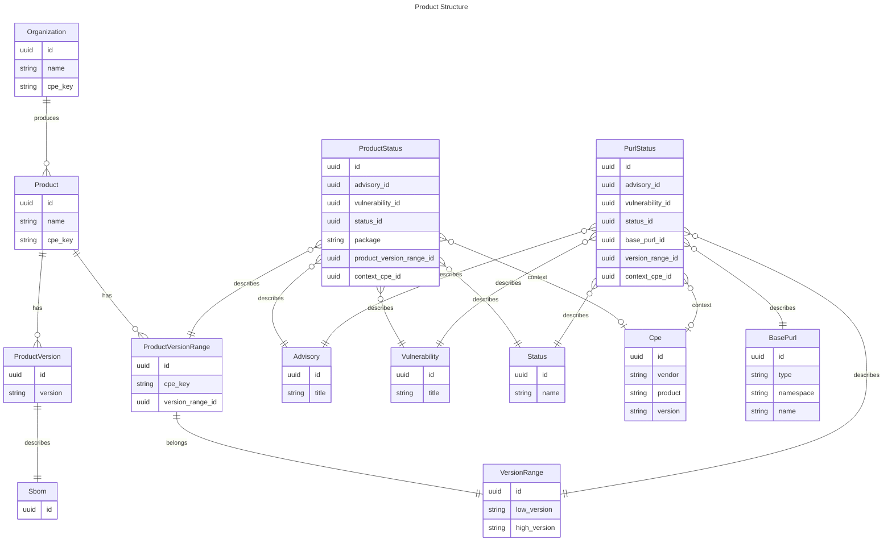

```mermaid
---
title: Product Structure
---
erDiagram

    Organization {
        uuid id
        string name
        string cpe_key
    }

    Product {
        uuid id
        string name
        string cpe_key
    }

    ProductVersion {
        uuid id
        string version
    }

    ProductVersionRange {
        uuid id
        string cpe_key
        uuid version_range_id
    }

    VersionRange {
        uuid id
        string low_version
        string high_version
    }

    Advisory {
        uuid id
        string title
    }

    Vulnerability {
        uuid id
        string title
    }

    Status {
        uuid id
        string name
    }

    Cpe {
        uuid id
        string vendor
        string product
        string version
    }

    BasePurl {
        uuid id
        string type
        string namespace
        string name
    }

    ProductStatus {
        uuid id
        uuid advisory_id
        uuid vulnerability_id
        uuid status_id
        string package
        uuid product_version_range_id
        uuid context_cpe_id
    }

    PurlStatus {
        uuid id
        uuid advisory_id
        uuid vulnerability_id
        uuid status_id
        uuid base_purl_id
        uuid version_range_id
        uuid context_cpe_id
    }

    Sbom {
        uuid id
    }

    Organization || -- o{ Product : produces
    Product || -- o{ ProductVersion : has
    ProductVersion || -- || Sbom : describes

    Product || -- o{ ProductVersionRange : has
    ProductVersionRange || -- || VersionRange : belongs

    ProductStatus }o -- || Advisory : describes
    ProductStatus }o -- || Vulnerability : describes
    ProductStatus }o -- || Status : describes
    ProductStatus }o -- || ProductVersionRange : describes
    ProductStatus }o -- o| Cpe : "context"

    PurlStatus }o -- || Advisory : describes
    PurlStatus }o -- || Vulnerability : describes
    PurlStatus }o -- || Status : describes
    PurlStatus }o -- || BasePurl : describes
    PurlStatus }o -- || VersionRange : describes
    PurlStatus }o -- o| Cpe : "context"

```
