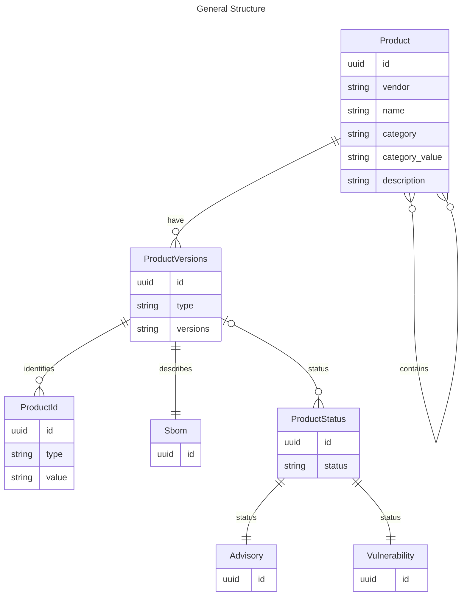

### Product

```
Red Hat / RHEL 8 -> Red Hat / RHEL 8 / arch / x86
Red Hat / RHEL 8 -> Red Hat / RHEL 8 / arch / arm64


Red Hat / AMQ -> Red Hat / AMQ / family / AMQ Clients
Red Hat / AMQ -> Red Hat / AMQ / family / AMQ Brokers
Red Hat / AMQ -> Red Hat / AMQ / family / AMQ Streams
```

### Versions

`ProductVersions` follow `vers` specification. It can contain a single version, version ranges and combination of those.

https://github.com/package-url/purl-spec/blob/version-range-spec/VERSION-RANGE-SPEC.rst


```
vers:all/*
vers:semver/1.2.3|>=2.0.0|<5.0.0
vers:generic/0.1.0.redhat-00010
vers:redhat/3.4.3.Final-redhat-00001
vers:redhat/4.1.86-1.Final_redhat_00001.1.el8eap
vers:redhat/1.23.5-15.rhaos4.10.git0bbb0d9.el7
vers:fixed/1.23.5-15.rhaos4.10.git0bbb0d9.el7
```

### Identifiers

```
cpe:/a:redhat:a_mq_clients:2 -> Red Hat / AMQ -> Red Hat / AMQ / family / AMQ Clients / >=2.0.0
```

### Status

```
fixed: RHSA-2023:7697 -> CVE-2023-1370 -> AMQ Clients >=2.0|<3.0 
```

### References

* https://github.com/openvex/spec/blob/main/OPENVEX-SPEC.md#product-data-structure
* https://en.wikipedia.org/wiki/Common_Platform_Enumeration
* https://access.redhat.com/security/cve/CVE-2023-1370
* https://access.redhat.com/errata/RHSA-2023:7697
* https://access.redhat.com/security/data/csaf/v2/advisories/2023/rhsa-2023_7697.json
* https://github.com/CVEProject/cvelistV5/blob/main/cves/2023/1xxx/CVE-2023-1370.json
* https://github.com/cisagov/CSAF/blob/develop/csaf_files/OT/white/2019/icsa-19-099-03.json

### Questions?

* Can SBOM describe the product range? 
* Can we identify packages with cpes (cpe:2.3:a:apache:log4j:2.4:*:*:*:*:*:*:*)?
* Do we need cpes and qualified packages?
* 